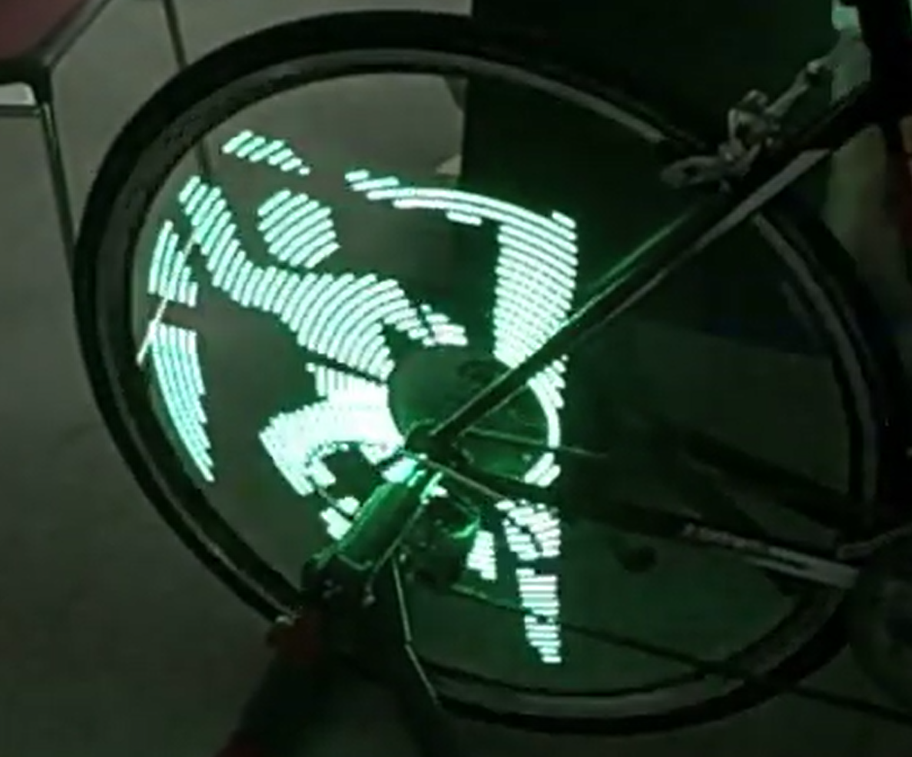

# About Me

I'm a freshman Cal Poly Computer Engineering student excited to try new things!

Currently a member of the Barbell Club, Entrepreneurship Club, and Computer Engineering Society

## Contact Me

<a href="https://www.linkedin.com/in/nathan-st-john-7a3992236/">LinkedIn</a> | <a href="mailto:nastjohn@calpoly.edu">Email</a>

## Projects

LED Wheel Screen

(Inspirational image above)

I am currently working on an LED wheel design that can display images when cycling at high speeds. The design works because an LED strip attached to the wheel changes colors based on its position during the wheel's rotation. The position is determined when the wheel passes the fork of the bike, which is caused by the reflection of an IR sensor and a gyroscopic sensor to determine any significant changes in speed before the bike passes the fork.

**Skills:** Arduino, C++, Solidworks

### Completed

**Doodle Wizard - OPGC Game Jam**

Doodle Wizard is a third-person magical adventure game where players control Felis, a self-conscious wizard sent by the king to retrieve four crystal shards from magical islands. Along the way, Felis uncovers conflicts between the islands and begins to question the king’s true motives. I led the project and developed a custom sketch recognizer inspired by the PaleoSketch research, allowing players to cast spells by drawing shapes. This system preprocesses sketches, extracts geometric data, and matches it with stored spell templates, creating an interactive and realistic spellcasting experience.

**Skills:** Unity, C#, Clang, Project Management

<a href="https://tms.ogpc.info/Games/Details/7295c811-c989-4d59-9c9a-c522335eb9a5">Play</a> | <a href="https://github.com/TigardHighGDC/WizardGame">Repo</a>

**Unit Circle Galaga**

A quick project I developed in a couple of hours for Calculus class. I didn't find any good methods online to memorize the unit circle, so I wanted to gamify the memorization process. 

**Skills:** Unity, C#

<a href="https://galaxy25.github.io/UnitCircleGalagaWebsite/">Play</a> | <a href="https://github.com/Galaxy25/UnitCircleGalaga">Repo</a>

**Fencing Mount**

I wanted a fencing mount to practice fencing at home. While there were 3D printable holders, they were for other fencing divisions (Epee, Foil), so I decided to create a 3D mount for Sabre and share it with the fencing community.

<a href="https://www.reddit.com/r/Fencing/comments/wzfokx/a_cad_high_school_project/">Post</a> | <a href="https://github.com/Galaxy25/FencingMount/tree/main">Repo</a>

**Skills:** Solidworks

## Competitive Programming

**Skills:** Python, Algorithm Analysis
